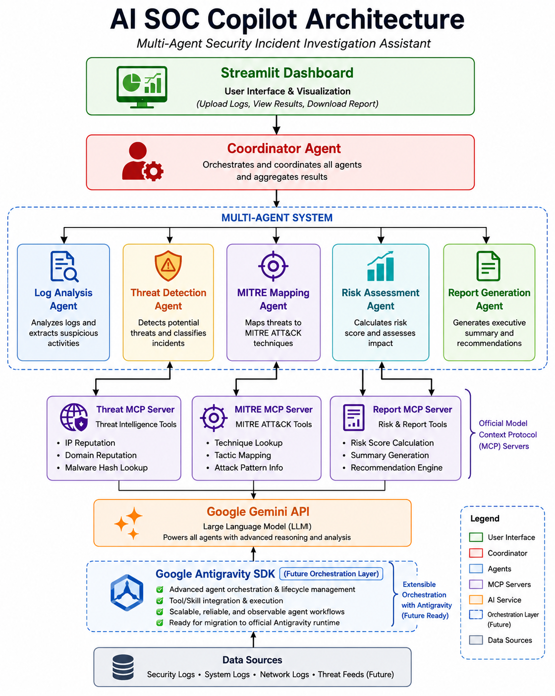
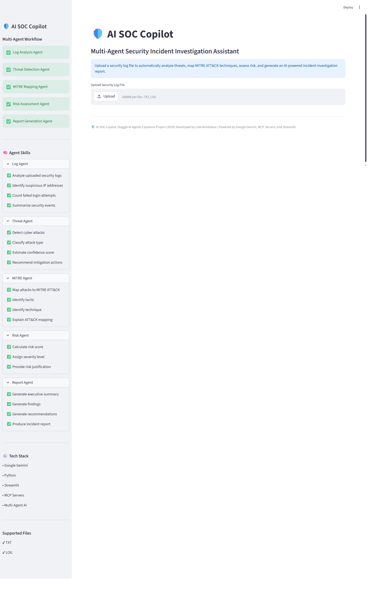
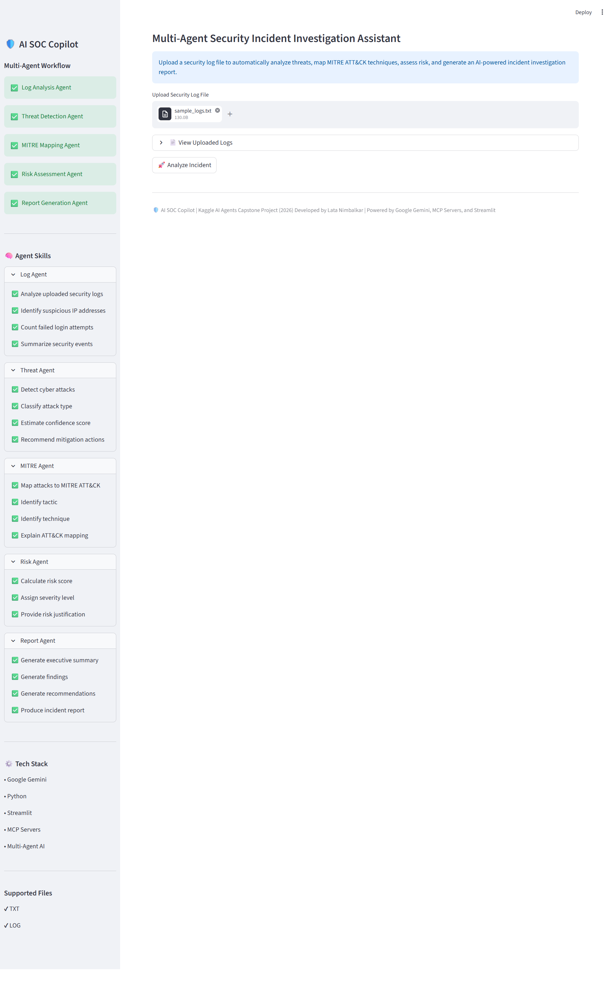
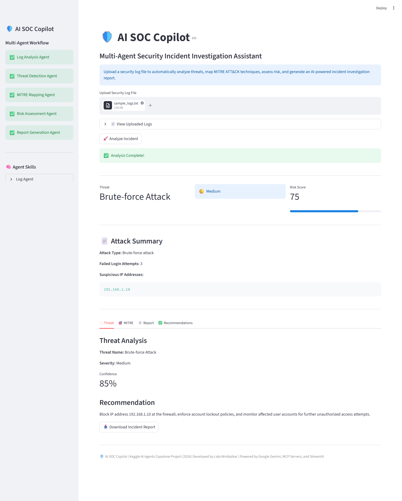

# 🛡️ AI SOC Copilot

## Multi-Agent Security Incident Investigation Assistant


---

# Overview

AI SOC Copilot is a **Multi-Agent AI-powered Security Incident Investigation Assistant** developed as part of the **Kaggle AI Agents Capstone Project (2026)**.

The application helps Security Operations Center (SOC) analysts investigate security incidents by automatically:

- Analyzing security logs
- Detecting cyber threats
- Mapping attacks to MITRE ATT&CK
- Assessing incident risk
- Generating executive investigation reports

The project demonstrates modern AI engineering concepts including **multi-agent orchestration**, **Model Context Protocol (MCP)** integration, **Google Gemini**, and **Google Antigravity SDK**.

---

# Features

- 📂 Upload TXT and LOG security log files
- 🤖 AI-powered log analysis using Google Gemini
- 🚨 Threat detection and classification
- 🎯 MITRE ATT&CK technique mapping
- 📊 Risk assessment with severity scoring
- 📄 Executive incident report generation
- 📥 Download investigation report
- 🖥️ Interactive Streamlit dashboard
- 🔌 Modular MCP servers
- 🧠 Multi-Agent AI architecture

---

# 🧠 Multi-Agent Architecture

The AI SOC Copilot follows a modular multi-agent architecture coordinated by a central **Coordinator Agent**.

Specialized AI agents perform log analysis, threat detection, MITRE ATT&CK mapping, risk assessment, and report generation. MCP servers provide reusable cybersecurity tools, while Google Gemini powers AI reasoning.



---

## AI Agents

### 📄 Log Analysis Agent

- Parses uploaded security logs
- Extracts suspicious IP addresses
- Detects attack type
- Counts failed login attempts
- Generates investigation summary

---

### 🚨 Threat Detection Agent

- Detects potential cyber threats
- Classifies incident severity
- Calculates confidence score
- Provides remediation recommendations

---

### 🎯 MITRE Mapping Agent

- Maps attacks to MITRE ATT&CK
- Identifies ATT&CK techniques
- Explains attacker behavior

---

### 📊 Risk Assessment Agent

- Calculates overall risk score
- Determines incident severity
- Assesses business impact

---

### 📝 Report Generation Agent

- Generates executive summaries
- Produces investigation findings
- Creates actionable recommendations
- Builds downloadable incident reports

---

# MCP Servers

The project uses **Model Context Protocol (MCP)** servers to provide reusable cybersecurity capabilities.

## Threat Intelligence MCP Server

Provides tools for:

- IP Reputation Lookup
- Domain Reputation Lookup
- Malware Hash Lookup

---

## MITRE MCP Server

Provides tools for:

- ATT&CK Technique Lookup
- ATT&CK Tactic Mapping
- Technique Information

---

## Report MCP Server

Provides tools for:

- Risk Score Calculation
- Report Generation
- Executive Summary Creation

---

# Google Antigravity SDK

This project also demonstrates integration with the **Google Antigravity SDK**, enabling AI agents to interact with external tools through the Model Context Protocol (MCP).

The SDK complements the multi-agent architecture by supporting standardized AI tool execution.

---

# Project Structure

```
AI-SOC-COPILOT/

├── agents/
│   ├── coordinator_agent.py
│   ├── log_agent.py
│   ├── threat_agent.py
│   ├── mitre_agent.py
│   ├── risk_agent.py
│   └── report_agent.py
│
├── mcp_servers/
│   ├── threat_server.py
│   ├── mitre_server.py
│   ├── report_server.py
│   └── server.py
│
├── models/
│
├── skills/
│
├── docs/
│   ├── architecture.png
│   ├── Initial Dashboard.png
│   ├── upload_log_file.png
│   ├── Analysis_dashboard.png
│   └── sample_incident_report.txt
│
├── data/
│
├── app.py
├── config.py
├── requirements.txt
└── README.md
```

---

# Technology Stack

- Python 3.14
- Google Gemini API
- Google Antigravity SDK
- Streamlit
- Model Context Protocol (MCP)
- Pydantic
- python-dotenv

---

# Installation

## Clone the repository

```bash
git clone <repository-url>
cd AI-SOC-COPILOT
```

## Install dependencies

```bash
pip install -r requirements.txt
```

## Configure Environment Variables

Create a `.env` file.

```env
GEMINI_API_KEY=YOUR_API_KEY
```

## Run the application

```bash
py -m streamlit run app.py
```

---

# Workflow

1. Upload a security log file.
2. Log Analysis Agent analyzes uploaded logs.
3. Threat Detection Agent identifies potential attacks.
4. MITRE Mapping Agent maps ATT&CK techniques.
5. Risk Assessment Agent calculates overall risk.
6. Report Generation Agent creates the investigation report.
7. Results are displayed in the Streamlit dashboard.

---

# Sample Output

The dashboard provides:

- Threat Name
- Attack Type
- Suspicious IP Addresses
- Failed Login Attempts
- Severity Level
- Confidence Score
- Risk Score
- MITRE ATT&CK Technique
- Executive Summary
- Investigation Findings
- Recommendations
- Downloadable Incident Report

---

# Screenshots

## Initial Dashboard



---

## Upload Security Log



---

## Analysis Dashboard



---

## Sample Incident Report

A sample generated incident report is available at:

`docs/sample_incident_report.txt`

---

# Future Improvements

- Real-time SIEM integration
- Threat Intelligence APIs
- VirusTotal integration
- Splunk integration
- PDF report generation
- Docker deployment
- Authentication and Role-Based Access Control (RBAC)
- Cloud deployment (GCP/AWS/Azure)

---

# Author

**Lata Nimbalkar**

Cybersecurity | AI Security | Multi-Agent Systems | Google Gemini | MCP | SOC Automation

Developed as part of the **Kaggle AI Agents Capstone Project (2026)**.

---

# License

This project is intended for educational and portfolio purposes.